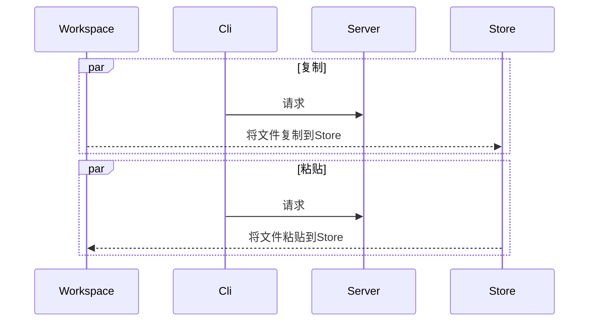

功能:  

* [ ] 复制/粘贴文件
* [ ] 从剪切板读取/写入文件
* [ ] 给文件设置标签和分组

### Cli

复制
cp copy [name] 
* path: 要复制的文件名称
* -t , --tag: 设置标签
* -g , --group: 设置分组

粘贴
cp paste [name]
* name: 要粘贴文件的名称

```mermaid
sequenceDiagram
    participant Workspace
    participant Cli
    participant Server
    participant Store

    par 复制
      Cli ->> Server: 请求
      Workspace -->> Store: 将文件复制到Store
    end

    par 粘贴
      Cli ->> Server: 请求
      Store -->> Workspace: 将文件粘贴到Store
    end

```